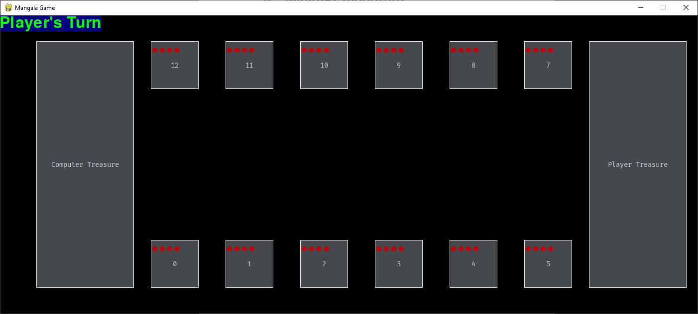
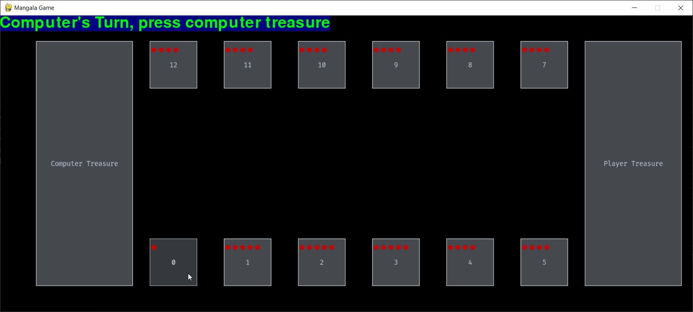
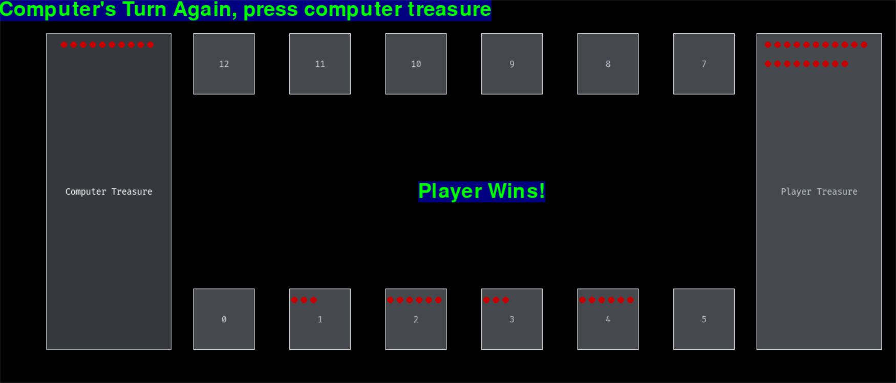

# Mangala
Python Implementation of Turkish Mangala Game With a Simple GUI.

# Running Instructions
``` pip install -r requirements.txt ```

# Gameplay
Press a pit to make your move when it’s the Player’s turn. To initiate the computer make a move, you should press to the “Computer Treasure”.

Follow the instructions in the box that is placed on top left of the screen.








# What is Mangala?
The board used for the strategy game Mangala includes two rows of six pits each, as well as two larger pits for each player that are referred to as "treasure pits" or "stores." Each player starts the game with four stones in each of their six pits and none in their treasure pit. The game is played with two players. The goal of the game is to fill your own treasure hole with more stones than your opponent.

Each time a player takes a turn, they choose one of their pits and      remove all the stones from it, and put one of the stones in the same pit. Then, remaining pits on the board, including their own and their opponent's, are then filled with the stones, one by one, in a counterclockwise direction. 

Current player plays again if the last dropped piece is in their treasure.

The player collects all of the stones in the opponent's pit as well as the pit directly across from it and adds them to their treasure pit if the final stone is dropped into their pit and that pit is empty.

Also, if the last piece is placed in one of the opponent's pool, and the pool is even, the stones in that pool are added to their treasure.


The player with the most stones in their treasure wins when all of the pits are empty. The match is considered as a draw if the number of stones in both treasures are the same.

# Computer Moves
In my code, the minimax algorithm only calculates the best outcome among the moves ranging between [7,12] since these are the only moves that the computer is allowed to make.
